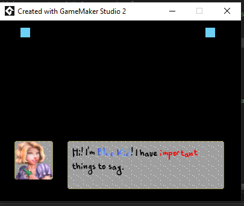

# Branching Dialog System
 Inspired by **Branching Dialog System with Effects in GMS 2!** which was created by [Peyton Burnham](https://twitter.com/peydinburnham).

 

Peyton has no affiliation with this project. However, I prefer to give credit where credit is due, and he did inspire me. [Would you mind watching Peyton's tutorial](https://www.youtube.com/playlist?list=PL14Yj-e2sgzzWFPozdX-HEjJFqjdIXQfF) as this work builds upon his? He probably does a better job explaining this than my measly comments will.

If you need assistance with this project, please open an issue, and I'll get to it when I can. I do have a full-time job, so that might take a bit of time. Hopefully, this project will help someone.

### This was built and compiled on windows 10.

## Alternatives

While working on this, I was directed by Reddit to [Scribble](https://github.com/JujuAdams/Scribble) and [Chatterbox](https://github.com/JujuAdams/chatterbox). These extensions implement most of what is here and more. If I had to do it over again, I'd probably start there. However, I figured this would still be helpful to someone. I suspect Scribble's implementation would be faster, but I have not tested it.

 ## Resources Used
- [Branching Dialog System with Effects in GMS 2!](https://www.youtube.com/playlist?list=PL14Yj-e2sgzzWFPozdX-HEjJFqjdIXQfF)
- [PIXILART](https://www.pixilart.com/)
- [Public Domain Haeres Letter Font](https://www.fontspace.com/haeres-letter-font-f53961)
- [Character Icons](https://free-game-assets.itch.io/free-rpg-fantasy-avatar-icons)
- [Sound Effects](https://www.fesliyanstudios.com/royalty-free-sound-effects-download/keyboard-typing-6)

## Notable Assets
- customFont - the font referenced above.
    - Do not tick copy to project or compilation fails. If anyone knows why, I'd love to to know how to fix it.
- objTextbox
  - All of the logic, setup, and display happens here.
- objSpeakerBlock
  - Carries knowledge of which NPC it is and kicks off conversations when it is clicked.
- scrGameText
  - Contains all of the games text and display runtime configuration.
- scrTextboxFunctions
  - enum of speaker locations
  - enum of valid characters
  - functions to populate data used in objTextbox or scrGameText
- rmDialogSystem
  - A room to hold our NPCs and display our dialog.
- various sprites
  - Provided to support our dialog system
- datafiles/Branching Dialog System.exe
  - In case you want to see it in action without compiling.